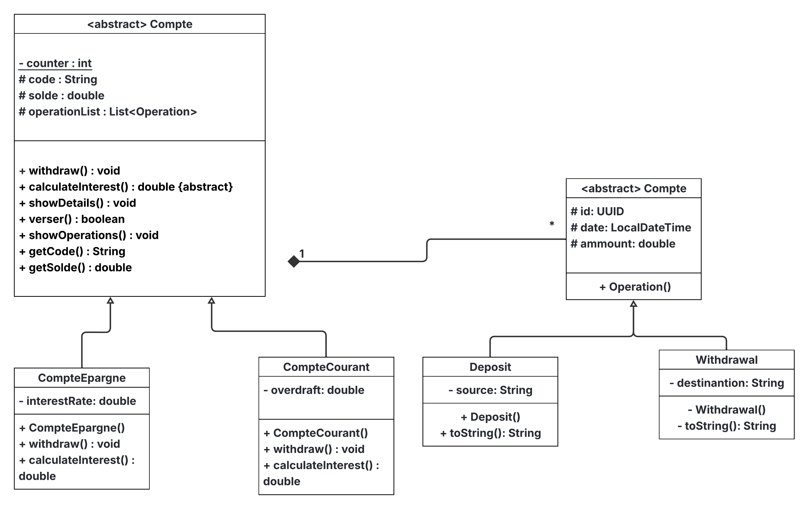

# Banka

A simple Java banking system management application.

## Features

- Create Compte Courant and Compte Epargne accounts
- Deposit, withdraw, and transfer funds
- View account details and transaction history
- Search and list accounts
- Basic statistics

## Getting Started

1. Clone the repository:
    ```sh
    git clone https://github.com/chehachraf/banka.git
    ```
2. Open the project in Eclipse or your preferred IDE.
3. Run the `MainApp` class in [src/presentation/MainApp.java](src/presentation/MainApp.java).

## Screenshot

<!-- Upload a screenshot of the app here -->


## Class Diagram

<!-- Upload your class diagram here -->


## Project Structure

```
src/
    model/
        Compte.java
        CompteCourant.java
        CompteEpargne.java
        Deposit.java
        Operation.java
        Withdrawal.java
    presentation/     
        MainApp.java     
    service/
        BanqueService.java
    ui/
        Menu.java
    util/
        CodeGeneratorUtility.java
        ValiditionUtility.java
```

## Authors

- Achraf chehboun

## License

This project is licensed under the MIT License.